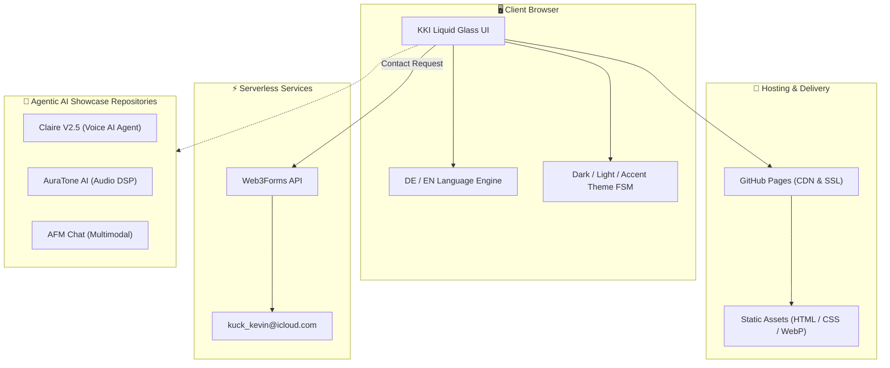

# CV_KKEEY: Agentic AI & Systems Engineering Portfolio

<div align="center">
  
  <h3>Kevin Kuck — IT Systems Engineer & Agentic AI Architect</h3>
  
  [](https://kkeey92.github.io/CV_KKEEY/)
  []()
  []()
  []()
</div>

---

## 🇩🇪 Deutsch

### Über dieses Repository
Dieses Repository beherbergt das offizielle interaktive Web-Portfolio von **Kevin Kuck** (IT Systems Engineer & Agentic AI Architekt). Es repräsentiert über 15 Jahre Praxiserfahrung an der Schnittstelle zwischen klassischer IT-Systemadministration (Active Directory, IAM, Entra ID, KRITIS) und modernster KI-Entwicklung (Vertex AI, LiveKit, Autonomous Agent Workflows, Audio DSP).

Das Interface basiert auf dem **KKI Liquid Glass Framework** (Neon Orange `#FF7A00`, Electric Cyan `#00E5FF`) mit dynamischen Theme-Switches, barrierefreier Typografie und responsiven Performance-Animationen.

### Core-Features & Highlights
- 🧠 **Agentic AI Showcase:** Live-Referenzen zu autonome Sprachagenten (*Claire V2.5 Native Audio*), Audio-Mastering (*AuraTone AI*) und multi-modalen Workflows (*AFM Chat*).
- 🔒 **DSGVO & DDG Compliance:** Integrierte rechtssichere Seiten für Impressum (§ 5 DDG) und Datenschutz (Art. 13 DSGVO).
- 🌐 **Zweisprachig (DE / EN):** Vollständig synchronisierter Sprachumschalter für internationale B2B-Anfragen und Stakeholder.
- ⚡ **High Performance:** Puristischer Tech-Stack ohne Framework-Overhead für minimale Ladezeiten.

---

## 🇬🇧 English

### Overview
This repository hosts the official interactive portfolio of **Kevin Kuck** (IT Systems Engineer & Agentic AI Architect). It highlights 15+ years of operational experience spanning enterprise IT system administration (Active Directory, IAM, Microsoft Entra ID, KRITIS security) and state-of-the-art AI engineering (Vertex AI, LiveKit Agents 2.x, Autonomous AI Agents, Audio DSP).

The web interface is built using the **KKI Liquid Glass Framework** featuring fluid neon themes, accessibility-first semantics, and real-time interactive micro-animations.

### Key Features
- 🧠 **Agentic AI Showcase:** Live references for autonomous voice companions (*Claire V2.5 Native Audio*), DSP audio mastering (*AuraTone AI*), and multimodal chat (*AFM Chat*).
- 🔒 **GDPR & Legal Compliance:** Built-in legal notice (Impressum) and GDPR-compliant privacy policy.
- 🌐 **Bilingual (DE / EN):** Instant language switching tailored for international enterprise clients and freelance contracts.
- ⚡ **Zero-Overhead Performance:** Native HTML5, vanilla CSS3 variables, and clean ES6 JavaScript modules.

---

## 🏗 Systemarchitektur / System Architecture



---

## 🛠 Local Development & Testing

```bash
# 1. Repository klonen / Clone repo
git clone https://github.com/KKEEY92/CV_KKEEY.git
cd CV_KKEEY

# 2. Lokalen Webserver starten / Start local webserver
python3 -m http.server 3000

# 3. Im Browser öffnen / Open in browser
# http://localhost:3000
```

---

## 💼 Freelance & Contact Information

**Kevin Kuck** — *IT Systems Engineer & Agentic AI Architect*  
Available for freelance architecture consulting, AI agent implementation, and enterprise IT engineering.

- 🌐 **Live Portfolio:** [kkeey92.github.io/CV_KKEEY/](https://kkeey92.github.io/CV_KKEEY/)
- 👔 **LinkedIn:** [linkedin.com/in/kevin-kuck-it/](https://www.linkedin.com/in/kevin-kuck-it/)
- 🦊 **GitLab:** [gitlab.com/KKEEY92](https://gitlab.com/KKEEY92)
- 🐙 **GitHub:** [github.com/KKEEY92](https://github.com/KKEEY92)

---
&copy; 2026 Kevin Kuck. All rights reserved. / Alle Rechte vorbehalten.
