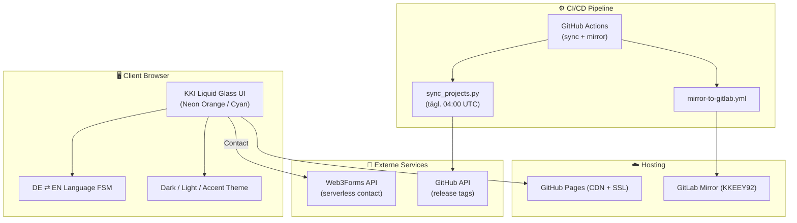

<div align="center">
  
  <h1>Kevin Kuck</h1>
  <p><strong>IT-Administrator · Systems Engineer · AI · Automation · Voice AI · Local-First Architecture</strong></p>

  [](https://kkeey.dev/)
  [](https://it.kkeey.dev/)
  [-Download-FF7A00?style=for-the-badge)](https://kkeey.dev/assets/Kevin_Kuck_Bewerbungsmappe_AI_2026.pdf)
  [-Download-00E5FF?style=for-the-badge)](https://kkeey.dev/assets/Kevin_Kuck_Master_CV_2026.pdf)
  [](https://www.linkedin.com/in/kevin-kuck-it/)
  []()
</div>

---

## 🇩🇪 Über dieses Profil

Dieses Repository beherbergt das offizielle interaktive Web-Portfolio von **Kevin Kuck** — IT-Administrator · Systems Engineer · AI mit **15 Jahren operativer Praxiserfahrung** an der Schnittstelle zwischen Enterprise-IT (Active Directory, IAM, KRITIS) und modernster KI-Entwicklung (Voice AI Agents, RAG, LiveKit, Python).

Verfügbar ab sofort — Remote & Hybrid.

## 🇬🇧 About This Portfolio

Official interactive portfolio of **Kevin Kuck** — IT-Administrator · Systems Engineer · AI with 15 years of operational experience bridging enterprise IT foundations (Active Directory, IAM, KRITIS) and state-of-the-art AI systems engineering (Voice AI, LiveKit, RAG, Local-First Architecture).

Available now — Remote & Hybrid.

---

## 🎯 Skill Matrix

### Agentic AI & Voice Systems


### Enterprise IT & Infrastructure


### Native & Web Development


---

## 🚀 Flagship Projects

### 🌌 Claire V2.5 — Enterprise Voice AI Agent
> Autonomes, emotionales Voice-AI-System mit ~200ms Latenz über WebRTC.

- **Stack:** Python 3.12+ · LiveKit 2.x · Gemini 2.5 Flash · Silero VAD · FastAPI · Google STT/TTS Chirp3-HD
- **Features:** Hybride Cloud/Local-Inferenz · Drive & Obsidian RAG · EmotionEngine · Multi-Modal
- **Repo:** [claire-v2-native](https://github.com/KKEEY92/claire-v2-native)

### 🎚️ AuraTone AI v2.0 — Native Audio Processing Engine
> Lokale macOS-Workstation für KI-gestützte Musik-Analyse & Metadaten-Management.

- **Stack:** Rust · Tauri 2.0 · SQLite Triade · Apple Metal GPU · Python DSP (librosa/ffmpeg) · Gemini 1.5 Pro
- **Features:** 120Hz Waveform-Visualisierung · Privacy-first (100% lokal) · Hermetische DSP-Sidecars
- **Repo:** [AuraTone-Architecture](https://github.com/KKEEY92/AuraTone-Architecture) *(Architecture Showcase)*

### 🏢 Johanniter KRITIS IAM — Enterprise Identity Management
> Administration von 90.000+ Benutzer-Identitäten & AD-Objekten in KRITIS-Infrastruktur für die gesamte Organisation.

- **Stack:** Active Directory · Microsoft Entra ID · PowerShell · LAPS · Deskcenter MDM · Exchange Admin
- **Scope:** Windows 11 Bundesrollout · OUs & Berechtigungsgruppen · Automatisierte Audit-Workflows

---

## 🏗️ Portfolio Architecture


```mermaid
graph TD
    subgraph Client["🖥️ Client Browser"]
        UI["KKI Liquid Glass UI\n(Neon Orange / Cyan)"]
        LANG["DE ⇄ EN Language FSM"]
        THEME["Dark / Light / Accent Theme"]
    end

    subgraph CI["⚙️ CI/CD Pipeline"]
        GHA["GitHub Actions\n(sync + mirror)"]
        SYNC["sync_projects.py\n(tägl. 04:00 UTC)"]
        MIRROR["mirror-to-gitlab.yml"]
    end

    subgraph Host["☁️ Hosting"]
        GHP["GitHub Pages (CDN + SSL)"]
        GL["GitLab Mirror (KKEEY92)"]
    end

    subgraph Ext["🔗 Externe Services"]
        W3F["Web3Forms API\n(serverless contact)"]
        GH_API["GitHub API\n(release tags)"]
    end

    UI --> GHP
    GHA --> SYNC --> GH_API
    GHA --> MIRROR --> GL
    UI --> LANG & THEME
    UI -->|Contact| W3F
```

---

## 📂 Repository Structure

```
CV_KKEEY/
├── index.html                  — Single Page Application (SPA)
├── css/
│   ├── style.css               — KKI Liquid Glass Design System
│   └── fonts.css               — Custom typography
├── js/
│   ├── main.js                 — App core, router, i18n, theme FSM
│   └── data.js                 — Project data (auto-updated via CI)
├── assets/                     — Images, avatar, project screenshots
├── scripts/
│   └── sync_projects.py        — GitHub API sync script
├── .github/workflows/
│   ├── sync-project-status.yml — Daily auto-update (04:00 UTC)
│   └── mirror-to-gitlab.yml    — GitLab mirror pipeline
└── legal/
    ├── impressum.html           — § 5 DDG Impressum
    └── datenschutz.html         — Art. 13 DSGVO Datenschutz
```

---

## ⚙️ Local Development

```bash
# Repository klonen
git clone https://github.com/KKEEY92/CV_KKEEY.git
cd CV_KKEEY

# Lokalen Dev-Server starten
python3 -m http.server 3000
# → http://localhost:3000

# CI/CD Sync manuell triggern (optional)
python3 scripts/sync_projects.py
```

---

## 📜 Zertifizierungen / Certifications

| Zertifikat | Aussteller | Jahr |
|---|---|---|
| Cisco Certified Support Technician IT Support | Pearson / Coursera | 2026 |
| Microsoft Generative AI Fundamentals (PMI®) | Microsoft | 2026 |
| ITIL 4 vs. ITIL 2011 | — | 2026 |
| Microsoft 365 Fundamentals MS-900 (I + II) | Microsoft | 2026 |
| Microsoft 365 Admin — Benutzersupport | Microsoft | 2026 |
| Windows 11 Troubleshooting IT Support | — | 2026 |

---

## 💼 Freelance & Contact

**Kevin Kuck** — *IT-Administrator · Systems Engineer · AI Agent Architekt*  
📍 Butzbach, DE · Remote verfügbar · DACH-Raum  
💶 Stundensatz: ab **70 EUR/h** · verhandelbar

| Kanal | Link |
|---|---|
| 🌐 AI Portfolio | [kkeey.dev](https://kkeey.dev/) |
| 🖥️ IT Portfolio | [it.kkeey.dev](https://it.kkeey.dev/) |
| 🗂️ Freelancermap | [freelancermap.de/profil/kevin-kuck](https://www.freelancermap.de/profil/kevin-kuck) |
| 👔 LinkedIn | [linkedin.com/in/kevin-kuck-it](https://www.linkedin.com/in/kevin-kuck-it/) |
| 🦊 GitLab | [gitlab.com/KKEEY92](https://gitlab.com/KKEEY92) |

---

<div align="center">
  <sub>© 2026 Kevin Kuck · All rights reserved · KKI-Standard v3.0</sub>
</div>
