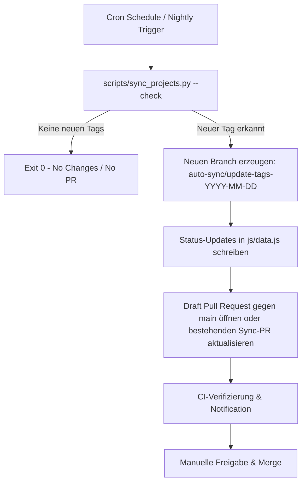

# Folgeticket: Refaktorisierung der Auto-Sync-Automation auf PR-Workflow

---
title: "refactor(sync): replace direct main pushes with pull-request workflow"
priority: "high"
status: "open"
version: "1.0.0"
created_at: "2026-08-01"
owner: "Kevin Kuck"
scope:
  - ".github/workflows/sync-project-status.yml"
  - "scripts/sync_projects.py"
  - "branch creation & checkout"
  - "gh pr create integration"
  - "concurrency control"
acceptance_criteria:
  - "Scheduled sync creates a dedicated branch"
  - "Changes are proposed through a pull request"
  - "No direct push to main"
  - "Concurrency prevents duplicate sync pull requests"
  - "No-op runs create no commit and no pull request"
  - "Unknown project IDs fail visibly"
  - "Dry-run changes no files"
  - "Existing open sync PR is updated instead of duplicated"
  - "Required CI must pass before merge"
  - "Merge remains a manual action"
---

## 1. Problemstellung

Der aktuelle GitHub-Actions-Workflow (`.github/workflows/sync-project-status.yml`) führt automatische Updates von Git-Tags direkt per Push auf den `main`-Branch von `CV_KKEEY` aus.

**Risiken des Direkt-Push-Ansatzes:**
1. **Branch-Divergenz:** Ein automatischer Push auf `main` führt dazu, dass parallele Open-Feature-Branches / Pull Requests (wie z. B. PR #4) hinter `main` zurückfallen und rebased werden müssen.
2. **Fehlendes Review-Gate:** Stille Syntax- oder Rendering-Fehler durch unvorhergesehene API-Formatänderungen gelangen ohne manuelle oder automatische PR-Checks direkt in die Produktion (GitHub Pages).

---

## 2. Zielzustand (PR-basiert)

Künftiger Ablauf des täglichen Sync-Jobs:

---

## 3. Akzeptanzkriterien & Details

- **Erstellung isolierter Branches:** Bei erkannten Tag-Updates wird ein dedizierter Branch `auto-sync/update-tags-YYYY-MM-DD` erzeugt.
- **Pull-Request-Erstellung:** Ein automatischer Pull Request mit klarer Zusammenfassung der geänderten Tags wird geöffnet.
- **Verbot von Direkt-Pushes:** Kein direkter Push auf den `main`-Branch mehr.
- **Concurrency & Deduplizierung:** Bestehende offene Sync-PRs werden aktualisiert statt dupliziert.
- **No-Op Verhalten:** Bei unveränderten Tags wird kein Branch, kein Commit und kein PR erstellt.
- **Sichtbares Fehlerverhalten:** Unbekannte Projekt-IDs oder API-Fehler schlagen laut fehl (Exit-Code != 0).
- **Dry-Run:** `--dry-run` verändert keinerlei Dateien.
- **CI-Gate & Manuelle Freigabe:** CI-Tests müssen bestanden werden, der Merge bleibt eine manuelle Aktion von Kevin.
